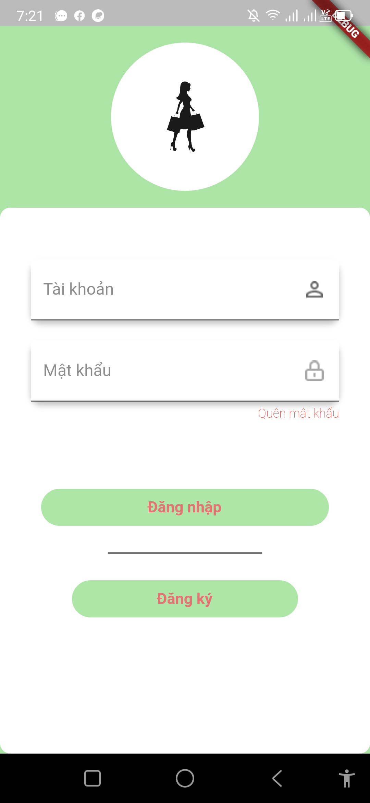
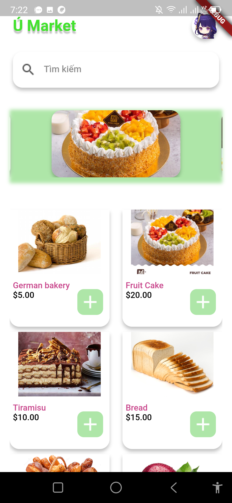
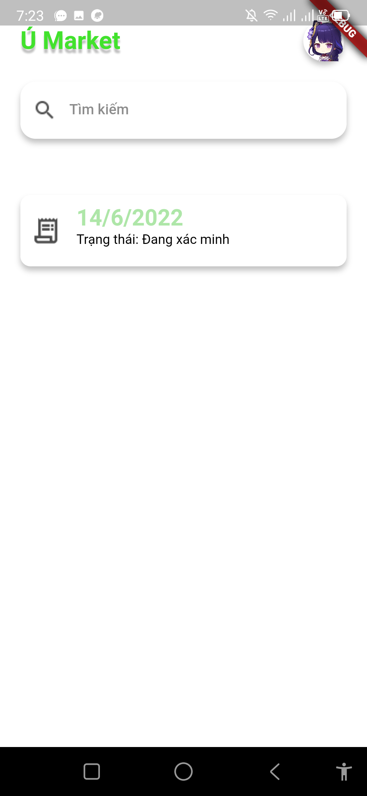

# App mobile Us_Market

Ứng dụng mua hàng US đối với người dùng

1. Sử dụng Provider để quản lí state
2. Sử dụng firestore để lưu trữ dữ liệu
3. Màn hình tối thiểu để sử dụng: height - 541, Width - 325
4. Link apk: https://drive.google.com/file/d/1sLfxh3Uvv8eBQa3w-7otU_RT_Xe1LVT2/view?usp=sharing

Các màn hình có trong ứng dụng

  

  

  

  

  

  

  

  

  

  

  

